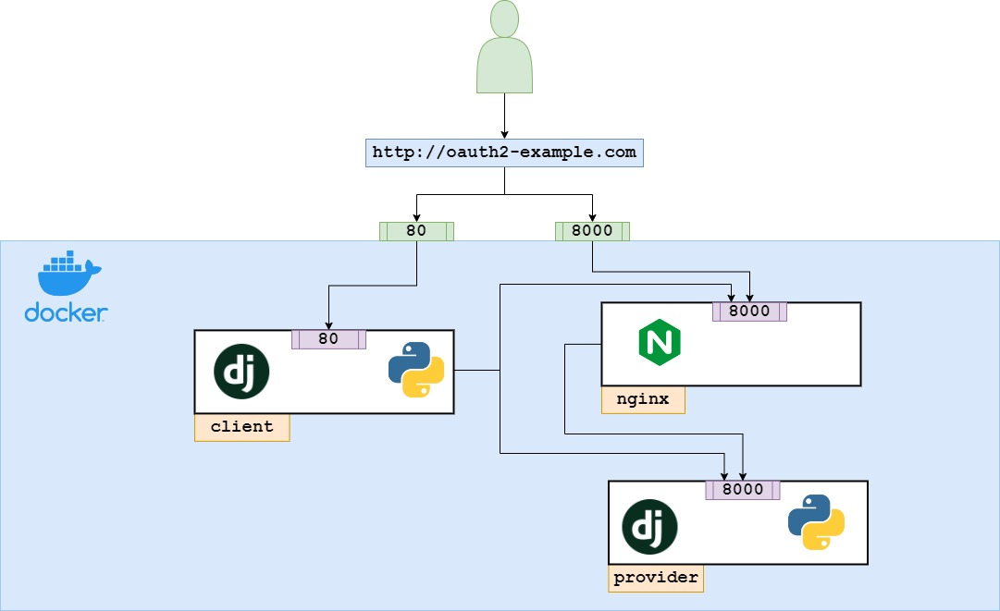

# Django OAuth2 Example

Данные репозиторий содержит пример того, как можно реализовать с
использованием фреймворка django сервер авторизации по OAuth2 (провайдер)
и клиентское приложение, которое позволяет авторизоваться с помощью данных
пользователя провайдера.

## Развертывание приложения

Для того чтобы запустить приложение, в папке проекта выполните команду:

#### `docker-compose up -d`

После этого станут доступны следующие разделы:
#### Клиент
* [http://127.0.0.1/]() &ndash; Основная страница приложения 
* [http://127.0.0.1/api/]() &ndash; API приложения
* [http://127.0.0.1/admin/]() &ndash; Административная панель
* [http://127.0.0.1/api/swagger/]() &ndash; Swagger-документация к API

#### Провайдер
* [http://127.0.0.1:8000/]() &ndash; Основная страница приложения 
* [http://127.0.0.1:8000/api/]() &ndash; API приложения
* [http://127.0.0.1:8000/admin/]() &ndash; Административная панель
* [http://127.0.0.1:8000/api/swagger/]() &ndash; Swagger-документация к API

Помимо этого необходимо создать суперпользователя командой:
#### `docker exec -it oauth-example-provider python manage.py createsuperuser` 

И собрать статические файлы:
#### `docker exec -it oauth-example-provider python manage.py collectstatic` 

## Инфраструктура приложения
